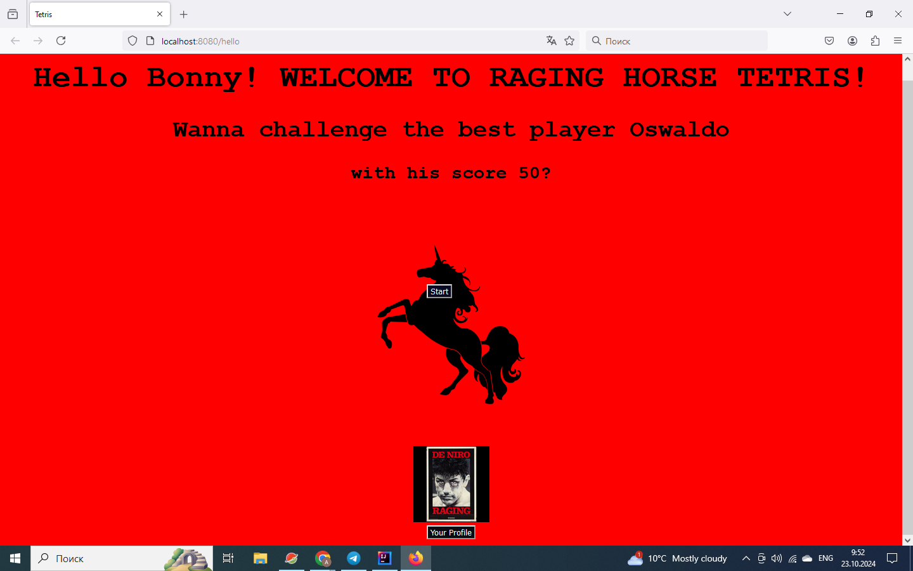

Java Tetris Game Springboot Application

To run the game in Docker do the following steps:

-clone the project to your local repo 

- pack the war file: 

  mvn clean package

- build the image:

  docker build -t tetris-new:0.0.1 .

- run the compose yaml file:

docker-compose -f DockerCompose.yml up

- open browser at http://localhost:8080/hello